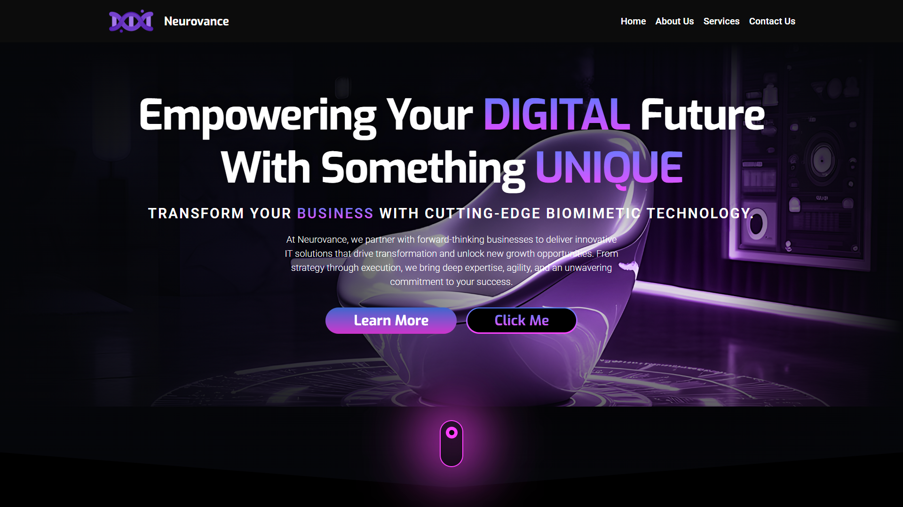

<p align="center">
  
</p>

<h1 align="center">🫐 Neurovance</h1>
<p align="center">
  A modern Next.js website for biomimetic robotics and digital transformation.
</p>

<p align="center">
  
  
  
  
  
</p>

## Overview

Neurovance is a polished landing-page style website built with Next.js. It presents a futuristic brand story around biomimetic robotics, digital innovation, and IT consulting through animated sections, reusable UI blocks, and rich media content.

This project is built as a frontend-first Next.js application using the App Router. It includes a hero slideshow, service highlights, about sections, a media gallery, a contact form, custom motion effects, and dedicated error states.

## Features

- Animated hero section with rotating banner imagery
- About sections focused on biomimetic robotics and digital transformation
- Service showcase with icon-based feature cards
- Media gallery with responsive images and embedded video
- Contact form with client-side validation
- Reusable header, footer, section, container, and title components
- Custom cursor and preloader for a more premium feel
- Scroll animations powered by AOS
- Motion and interaction polish using GSAP and Framer Motion
- Responsive layout with theme support via `next-themes`
- Custom `404` and server error pages

## Tech Stack

- Next.js 15
- React 19
- Tailwind CSS 4
- AOS
- GSAP
- Framer Motion
- Swiper
- MixItUp
- React Icons
- Nodemailer
- Google OAuth2 / Google APIs

## Main Sections

- Hero: rotating visual banner with brand messaging
- About: company intro and mission statements
- Services: six highlighted service offerings
- Gallery: image grid and embedded video showcase
- Contact: form for sending messages

## Setup

### Prerequisites

- Node.js 18 or newer
- npm

### Install

```bash
npm install
```

### Run locally

```bash
npm run dev
```

Open `http://localhost:3000` in your browser.

### Production build

```bash
npm run build
npm start
```

## Project Structure

```text
neuro-vance/
├── README.md
├── LICENSE
├── banner.png
├── public/
├── screenshots/
├── src/
│   ├── app/
│   ├── components/
│   ├── data/
│   ├── styles/
│   └── utils/
├── next.config.mjs
├── package.json
├── postcss.config.mjs
└── eslint.config.mjs
```

## Screenshots

The repository includes preview images in the `screenshots/` folder.


## Notable UI Elements

- Fixed navigation with mobile drawer
- Animated page transitions and reveal effects
- Decorative custom cursor on large screens
- Reusable call-to-action buttons
- Professional footer with social links and quick navigation
- Graceful error pages for `404` and server issues


## License

This project is licensed under the MIT License. See [LICENSE](LICENSE) for details.


## Author
Ashish Kumar